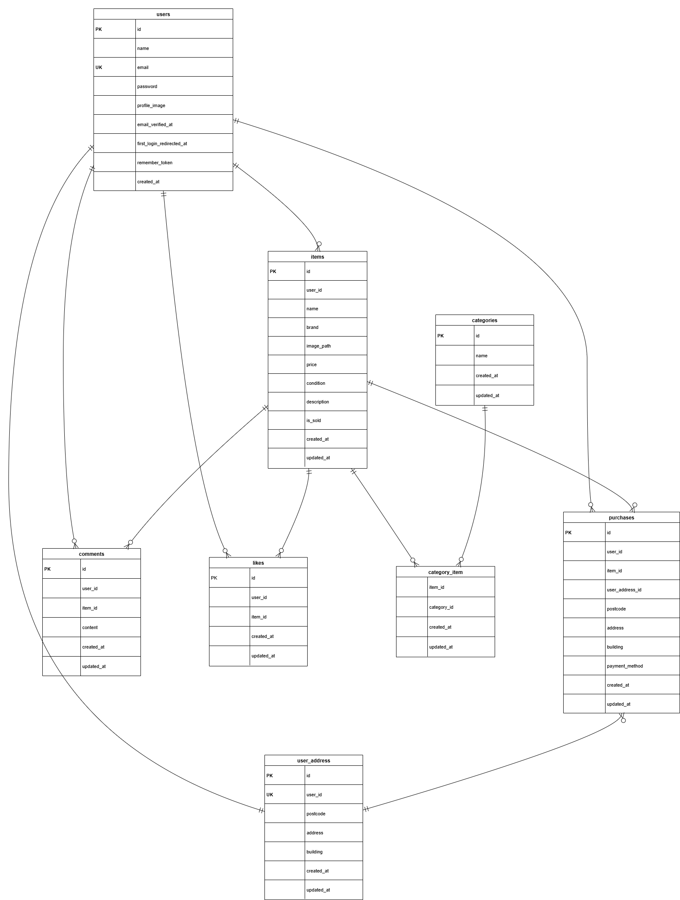

# furima（coachtechフリマ）

Laravelを用いて作成したフリマアプリです。
ユーザー登録から商品出品・購入までの一連の流れを実装しています。

## 主な機能

- ユーザー登録・ログイン
- 商品一覧・商品詳細表示
- 商品出品・編集・削除
- 商品購入
- マイページ表示
- お気に入り機能

## 追加実装機能
- 取引チャット機能
- 画像付きメッセージ送信
- 取引完了後の相互評価機能
- 評価平均表示
- 評価完了通知メール

※ 追加機能の詳細は `README_extension.md` を参照してください。

## ER図

## URL（開発環境）

- アプリ: http://localhost/
- phpMyAdmin: http://localhost:8080
- Mailhog: http://localhost:8025

## 環境構築

### Docker ビルド

1.git clone https://github.com/hirata21/furima.git

2.DockerDesktop アプリを立ち上げる

3.docker-compose up -d --build

### Laravel 環境構築

1.docker-compose exec php bash

2.composer install

3.「.env.example」ファイルを 「.env」ファイルに命名を変更。

4..env に以下の環境変数を追加

DB_CONNECTION=mysql

DB_HOST=mysql

DB_PORT=3306

DB_DATABASE=laravel_db

DB_USERNAME=laravel_user

DB_PASSWORD=laravel_pass

5.アプリケーションキーの作成

php artisan key:generate

6.マイグレーションの実行

php artisan migrate

7.シーディングの実行

php artisan db:seed

8.ストレージリンクの作成

php artisan storage:link

9.権限（必要なとき）

chown -R www-data:www-data storage bootstrap/cache
chmod -R ug+rwx storage bootstrap/cache

## 使用技術（実行環境）

・Laravel 8.75

・PHP 7.4.9

・MySQL 8.0.26
