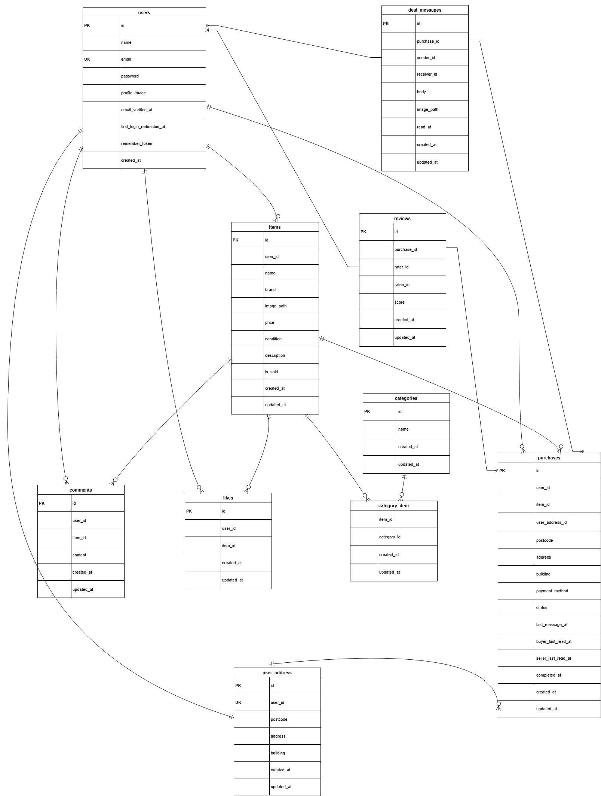

# furima-extended（coachtechフリマ追加実装）

## 概要
本リポジトリは、既存のフリマアプリ（furima）に
**取引チャット・評価機能** を追加実装したものです。

## 実装した機能一覧
- 取引ごとのチャット機能
- 画像付きメッセージ送信
- 取引完了後の相互評価機能
- 評価平均の自動計算・表示
- 評価完了後の通知メール送信

## 機能詳細

### ① 取引チャット機能
- 購入者・出品者のみがアクセス可能
- テキスト（最大400文字）と画像送信に対応
- 自分と相手で吹き出しの向きを変更

### ② 評価機能
- 取引完了後、購入者が先に評価し、その後出品者が評価
- 購入者が評価した段階で出品者に通知メール送信
- 評価は1〜5段階
- 両者評価完了後に取引を完了状態に更新


## ER図（追加実装分）
取引チャットおよび評価機能に関するテーブル構成です。




## テーブル設計（追加実装分）

※ 本セクションでは、取引チャット・評価機能に伴い
新規テーブルおよび既存テーブル（purchases）の追加カラムを記載します。

### 新規追加テーブル
- reviews
- deal_messages

### 既存テーブルへの追加カラム
- purchases

### reviews テーブル

| Column       | Type            | PK | UK | NOT NULL | FK              | Description              |
| ------------ | --------------- | -- | -- | -------- | --------------- | ------------------------ |
| id           | unsigned bigint | ○  |    | ○        |                 | Review ID                |
| purchase_id  | unsigned bigint |    |    | ○        | purchases(id)   | Purchase ID              |
| rater_id     | unsigned bigint |    |    | ○        | users(id)       | Reviewer user ID         |
| ratee_id     | unsigned bigint |    |    | ○        | users(id)       | Reviewed user ID         |
| score        | integer         |    |    | ○        |                 | Score (1–5)              |
| created_at   | timestamp       |    |    |          |                 | Created at               |
| updated_at   | timestamp       |    |    |          |                 | Updated at               |


### deal_messages テーブル

| Column       | Type            | PK | UK | NOT NULL | FK              | Description              |
| ------------ | --------------- | -- | -- | -------- | --------------- | ------------------------ |
| id           | unsigned bigint | ○  |    | ○        |                 | Message ID               |
| purchase_id  | unsigned bigint |    |    | ○        | purchases(id)   | Purchase ID              |
| sender_id    | unsigned bigint |    |    | ○        | users(id)       | Sender user ID           |
| body         | text            |    |    |          |                 | Message body             |
| image_path   | varchar(255)    |    |    |          |                 | Image path (nullable)    |
| created_at   | timestamp       |    |    |          |                 | Created at               |
| updated_at   | timestamp       |    |    |          |                 | Updated at               |


### purchases テーブル（追加カラム）

| Column               | Type      | NOT NULL | Description |
|----------------------|-----------|----------|-------------|
| status               | string    | ○        | 取引ステータス（trading / completed） |
| last_message_at      | timestamp |          | 最新メッセージ送信日時（並び替え用） |
| buyer_last_read_at   | timestamp |          | 購入者の最終既読日時 |
| seller_last_read_at  | timestamp |          | 出品者の最終既読日時 |
| completed_at         | timestamp |          | 取引完了日時 |


## アプリケーションURL

- 開発環境: http://localhost/
- phpMyAdmin: http://localhost:8080
- Mailhog: http://localhost:8025

## 使用技術(実行環境)
- Laravel 8.75
- PHP 7.4.9
- MySQL 8.0.26
- Nginx 1.21.1
- phpMyAdmin（ポート8080で接続）
- Docker / Docker Compose v3.8
- Mailhog（開発用メール）


## 環境構築

### Docker ビルド

1. ターミナルを開き、下記コードを実行し、リポジトリをクローン
```
git clone https://github.com/hirata21/furima-extended.git
```

2. DockerDesktop アプリを立ち上げる

3. プロジェクトフォルダに移動して Docker を起動
```
cd furima-extended
docker-compose up -d --build
```

### Laravel 環境構築

1. PHPコンテナに入る
```
docker-compose exec php bash
```

2. 依存ライブラリをインストール
```
 composer install
```

3. 「.env.example」ファイルを 「.env」ファイルに命名を変更。
```
 cp .env.example .env
```

4. .env に以下の環境変数を追加

 ```データベース
 - DB_CONNECTION=mysql
 - DB_HOST=mysql
 - DB_PORT=3306
 - DB_DATABASE=laravel_db
 - DB_USERNAME=laravel_user
 - DB_PASSWORD=laravel_pass
 ```

 ```メール（開発環境：Mailhog）
 - MAIL_MAILER=smtp
 - MAIL_HOST=mailhog
 - MAIL_PORT=1025
 - MAIL_USERNAME=null
 - MAIL_PASSWORD=null
 - MAIL_ENCRYPTION=null
 - MAIL_FROM_ADDRESS=no-reply@example.test
 - MAIL_FROM_NAME="${APP_NAME}"
 ```

 ```Stripe（決済）
 - STRIPE_KEY=your_stripe_public_key
 - STRIPE_SECRET=your_stripe_secret_key
 ```
 ※ Stripeのキーは 各自のStripeダッシュボードで取得した値 を設定してください。

5. アプリケーションキーの作成
```
php artisan key:generate
```

6. マイグレーションの実行
```
php artisan migrate
```

7. シーディングの実行
```
php artisan db:seed
```

8. ストレージリンクの作成
```
php artisan storage:link
```

9. 権限（必要なとき）
```
chown -R www-data:www-data storage bootstrap/cache
chmod -R ug+rwx storage bootstrap/cache
```


## 開発用ログインアカウント

以下のユーザーは `php artisan db:seed` で自動作成されます。


### 一般ユーザー（出品者・購入者）

| 役割 | ユーザー名 | メールアドレス | パスワード |
|---|---|---|---|
| 出品者 | 出品者ユーザーA | seller1@example.com | password |
| 出品者 | 出品者ユーザーB | seller2@example.com | password |
| 一般ユーザー（未出品） | 未出品ユーザーC | noitem@example.com | password |


## PHPUnit テストについて

1. テスト用データベースの作成
 ```
 docker-compose exec mysql bash
 ```

 MySQL にログインします。パスワードはrootと入力
 ```
 mysql -u root -p
 ```

 ログイン後、テスト用のデータベースを作成します。
 ```
 create database test_database;
 ```

2. env.testingの作成
 PHPコンテナに入る
 ```
 docker-compose exec php bash
 ```

 .env をコピーして、テスト用の設定ファイルを作成します
 ```
 cp .env .env.testing
 ```

3. env.testing を編集
 アプリケーション
 ```
 APP_ENV=test
 ```

 データベース（テスト用）
 ```
 DB_DATABASE=test_database
 DB_USERNAME=root
 DB_PASSWORD=root
 ```

 メール（Mailhog）
 ```
 MAIL_MAILER=smtp
 MAIL_HOST=mailhog
 MAIL_PORT=1025
 MAIL_USERNAME=null
 MAIL_PASSWORD=null
 MAIL_ENCRYPTION=null
 MAIL_FROM_ADDRESS=no-reply@example.test
 MAIL_FROM_NAME="${APP_NAME}"
 ```

4. テスト用のアプリケーションキーを生成
 ```
 php artisan key:generate --env=testing
 ```

5. 設定キャッシュをクリア
 ```
 php artisan config:clear
 ```
6. テスト用データベースを初期化
 ```
php artisan migrate:fresh --env=testing
 ```

7. テストを実行
 ```
 php artisan test
 ```
